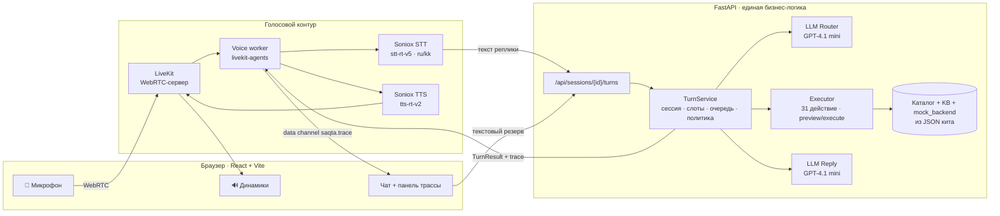

# Saqta Voice Router

**Голосовой AI-оператор контакт-центра страховой компании.** Клиент говорит в микрофон на русском, казахском или на смеси языков. LLM выбирает один из 40 сценариев Saqta Insurance, сервер выполняет шаг сценария на синтетических данных, клиент слышит ответ голосом. Супервизор после каждой реплики видит трассу решения.

Команда **Alt-Tab** · HackAlem AI 2026 · кейс 2 «Voice Router»

> Все вводные организаторов собраны в папке [case/](case/): JSON-данные (`scenarios.json`, `slots.json`, `actions.json`, `knowledge_base.json`, `mock_backend.json`, `dev_utterances.json`, `dialogs_sample.json`), оценщик `evaluate.py`, README кита на трёх языках и исходный текст задания. Файлы сохранены без изменений, приложение загружает их с диска. Все данные синтетические: Saqta Insurance, клиенты, полисы и цены вымышлены организаторами.

---

## Содержание

1. [Зачем это нужно](#зачем-это-нужно)
2. [Что умеет](#что-умеет)
3. [Как выглядит один ход](#как-выглядит-один-ход)
4. [Архитектура](#архитектура)
5. [Как принимается решение](#как-принимается-решение)
6. [Метрики](#метрики)
7. [Быстрый старт](#быстрый-старт)
8. [Проверки](#проверки)
9. [Ограничения](#ограничения)
10. [Структура репозитория](#структура-репозитория)
11. [Команда и документы](#команда-и-документы)

---

## Зачем это нужно

Контакт-центр страховой компании принимает звонки, где одно и то же слово означает разные вещи. «Авария» — это ДТП прямо сейчас (срочно), заявление пострадавшего по ОГПО виновника или убыток по КАСКО. «Выплату одобрили, но мало» — не запрос статуса, а спор с решением. Клиент может начать на казахском, закончить на русском и в одной фразе попросить две вещи.

Классический IVR с кнопками здесь не работает, а энкодерный классификатор намерений запрещён правилами кейса. Наше решение: **LLM читает весь каталог сценариев с границами `not_this_if` и сама объясняет, почему выбрала именно этот сценарий.** Голос и текст проходят через одну и ту же бизнес-логику, поэтому поведение агента одинаково в любом канале.

## Что умеет

| Возможность | Состояние |
|---|---|
| Живой голос в браузере: микрофон → STT → LLM → TTS → динамики | ✅ Проверено в Chrome на RU, KK и mixed репликах |
| Маршрутизация по 40 сценариям + 3 системным намерениям | ✅ Каталог загружается из `scenarios.json`, ID валидируются |
| Русский, казахский, смешанная речь | ✅ Язык определяется моделью, ответ — на языке клиента |
| Несколько намерений в одной фразе | ✅ Срочное первым, остальные — в очередь сессии и исполняются следом |
| Извлечение и проверка слотов (43 типа из `slots.json`) | ✅ Один уточняющий вопрос за ход |
| Трасса решения после каждой реплики | ✅ Сценарии, confidence, альтернативы, обоснование, слоты, действия, задержки |
| Политика уверенности: выбор / уточнение / оператор | ✅ Пороги 0.75 и 0.45 из правил кита |
| Все 31 mock-действие из `actions.json` | ✅ Data-driven исполнитель над копией `mock_backend.json` в памяти сессии |
| Идентификация клиента по телефону или ИИН | ✅ Номер полиса или заявления подставляется из данных клиента |
| Расчёты по формулам базы знаний | ✅ Цены ОГПО, travel, возврат при расторжении КАСКО сверены с диалогами кита |
| Preview → явное согласие → execute для необратимых действий | ✅ Согласие привязано к параметрам preview, новые параметры снимают старый preview |
| Идемпотентность: повтор `request_id` не повторяет действие | ✅ |
| Честный отказ: ошибка провайдера или данных не превращается в фиктивный успех | ✅ Коды ошибок только из `error_codes` кита, клиент слышит понятное сообщение |
| Передача оператору с резюме контекста | ✅ Очередь из `actions.json`, в UI помечена как симуляция |

## Как выглядит один ход

Реальный прогон в браузере 2026-09-23 (Chrome → LiveKit → Soniox → GPT-4.1 mini). Клиент говорит смешанной речью и просит две вещи сразу:

> 🎤 **Клиент:** «Маған терапевтке жазылу керек, и ещё список клиник в Алматы»

Что увидел супервизор в панели трассы (сокращённый `TurnResult`, значения из лога прогона):

```json
{
  "turn": 1,
  "transcript": "Маған терапевтке жазылу керек, и ещё список клиник в Алматы.",
  "language": "kk",
  "response_language": "kk",
  "scenarios": [
    {"scenario_id": "SC21", "confidence": 0.9},
    {"scenario_id": "SC23", "confidence": 0.8}
  ],
  "decision": "collect_slots",
  "slots": {"doctor_specialty": "терапевт", "city": "Almaty"},
  "missing_slots": ["policy_number", "preferred_date"],
  "queued_scenarios": ["SC23"],
  "reply": "Полис нөмірі қолыңызда болса, айтып жіберіңізші.",
  "latency_ms": {"stt": null, "router": 1820, "response": 696, "tts_first_audio": null, "total": null}
}
```

> 🔊 **Агент (на казахском):** «Полис нөмірі қолыңызда болса, айтып жіберіңізші» — просит номер полиса ДМС, чтобы записать к терапевту. Список клиник (SC23) ждёт в очереди сессии и исполнится после записи.

Оба намерения распознаны, слоты извлечены из одной фразы, ответ дан на языке клиента. Язык помечен `kk`, а не `mixed`: казахских слов больше. `null` в задержках означает «не измерено», а не «ноль»: worker пока не снимает STT и время до первого звука.

## Архитектура



| Слой | Технологии | Роль |
|---|---|---|
| Frontend | React 19, TypeScript, Vite, `livekit-client`, Zod | Диалог слева, трасса хода справа. Микрофон, звук, autoplay, восстановление истории |
| Транспорт | LiveKit (локальный, WebRTC) | Звук в обе стороны и data channel для трассы |
| Voice worker | `livekit-agents`, Soniox STT/TTS, Silero VAD | Распознаёт речь, вызывает тот же HTTP `/turns`, озвучивает ответ |
| Backend | FastAPI, Python 3.12, OpenAI SDK | Сессии, LLM-router, слоты, политика уверенности, исполнитель, трасса |
| LLM | GPT-4.1 mini, `temperature=0` | Выбор сценариев, извлечение слотов, разбор согласия, реплика агента |

**Ключевые решения**

- **Одна бизнес-логика для голоса и текста.** Worker не думает сам, он вызывает тот же `POST /turns`, что и текстовый ввод. Состояние живёт только в HTTP-сервисе.
- **Исполнитель управляется данными.** Интерфейсы действий, необратимость, очереди handoff и коды ошибок берутся из `actions.json`, формулы — из `knowledge_base.json`. Каждая сессия работает с собственной копией `mock_backend.json` в памяти.
- **Голосовой конвейер взят из рабочего продукта ALTCALL** (LiveKit + Soniox), а страховая логика, роутер и API написаны для кита. Что именно заимствовано: [THIRD_PARTY.md](THIRD_PARTY.md).
- **Ключи провайдеров только на сервере.** Браузер получает токен конкретной комнаты LiveKit на 15 минут.

## Как принимается решение

Каждая реплика проходит один и тот же путь:

1. **Router-вызов LLM.** В системный промпт входят все 40 сценариев с `description` и `not_this_if`, 3 системных намерения, каталог слотов и бизнес-дата `2026-10-01`. Модель возвращает строгий JSON: упорядоченные сценарии с confidence, альтернативы, язык, извлечённые слоты, признак продолжения, согласие или отказ на ожидающий preview и краткое обоснование на русском. ID вне каталога отбрасываются.
2. **Политика уверенности** из правил кита:
   - `confidence ≥ 0.75` → сценарий выбран;
   - `0.45 ≤ confidence < 0.75` или `SYS_UNCLEAR` → один уточняющий вопрос;
   - два хода подряд ниже `0.45`, сценарий с `handoff.when = always` или просьба клиента → передача оператору с резюме контекста.
3. **Слоты и очередь.** Извлечённые слоты проверяются по форматам `slots.json`. Если не хватает обязательного — один вопрос. Короткий ответ («Алматы») заполняет ожидаемый слот, а не открывает новую тему. Второе и следующие намерения ставятся в очередь сессии, срочные (`urgent`) обрабатываются первыми. Когда первый сценарий завершён, следующий из очереди исполняется в том же ходу, если его слоты уже известны.
4. **Идентификация.** `find_client` ищет клиента по телефону или ИИН в копии `mock_backend.json`. Если у клиента ровно один подходящий полис или заявление, номер подставляется без вопроса. Неизвестный клиент: один переспрос, затем handoff по `error_handling` из `actions.json`.
5. **Исполнение.** Действия с `irreversible: true` останавливаются на preview: результат считается на копии данных и озвучивается клиенту вместе с параметрами. Согласие или отказ распознаёт LLM в следующей реплике. Исполняются ровно сохранённые параметры; изменение параметров или новая тема снимают старый preview. Обратимые действия выполняются сразу.
6. **Reply-вызов LLM.** Отдельный запрос формирует реплику агента: 1–2 предложения, язык клиента, числа словами, имена собственные из KB не переводятся.
7. **Трасса.** Всё выше собирается в один `TurnResult` с `turn_id`, уходит в UI по data channel и сохраняется в истории сессии.

## Метрики

Реальный прогон `evaluate.py` организаторов на 104 репликах dev-набора. Predictions получены настоящими вызовами GPT-4.1 mini без контекста сессии; поле `expected` модели не передавалось.

| Группа | n | primary_acc | full_match |
|---|---|---|---|
| **all** | **104** | **0.952** | **0.942** |
| lang=kk | 45 | 0.978 | 0.956 |
| lang=ru | 52 | 0.923 | 0.923 |
| lang=mixed | 7 | 1.000 | 1.000 |
| type=single | 84 | 0.988 | 0.988 |
| type=multi_intent | 13 | 0.846 | 0.769 |
| type=out_of_scope | 4 | 1.000 | 1.000 |
| type=unclear | 3 | 0.333 | 0.333 |

intent_recall для multi-intent: **0.885**. Предыдущий прогон того же router дал 0.962 / 0.962: разница в 1–2 реплики — колебания модели.

**6 ошибок из 104**, все объяснимы:

| ID | Реплика | Ожидалось | Получено | Почему |
|---|---|---|---|---|
| U030 | «Шетелде аяғымды сындырып алдым, сақтандыруым бар» | SC15 | SC16 | Травма за границей: соседние сценарии «медслучай за рубежом» и «травма по НС» |
| U086 | «Шетелге шығуға сақтандыру керек, қалай төлеуге болады?» | SC06 + SC31 | SC06 | Пропущено второе намерение «как оплатить» |
| U087 | «Отказали в выплате, и ваш оператор ещё и нагрубил» | SC19 + SC35 | SC35 | Пропущено намерение «спор с решением» |
| U090 | «Соседи затопили квартиру, что делать и какие документы собирать?» | SC14 + SC18 | SC14 | Пропущено второе намерение «документы» |
| U102 | «Алло, я по поводу страховки» | SYS_UNCLEAR | SC37 | Слишком короткая реплика, модель предпочла сценарий |
| U104 | «Ну там с машиной вопрос» | SYS_UNCLEAR | SC13 | То же |

**10 диалогов кита** (`case/dialogs_sample.json`) прогнаны через живой API скриптом `scripts/run_dialogs.py`: 40 ходов, 0 ошибок HTTP, средний router 1,7–1,9 с. Полные циклы preview → согласие → execute прошли в D01 (покупка ОГПО, 38 000), D02 (заявление потерпевшего, KK), D07 (расторжение КАСКО, возврат 163 800, KK), D10 (travel, 15 400); идентификация по телефону с автоподстановкой полиса — D03, D05, D07; неизвестный клиент — переспрос и handoff. Промахи router: после «спасибо» модель иногда остаётся в сценарии вместо `SYS_GOODBYE`, а смену темы после жалобы или фрода (D06 t2, D09 t3) держит в прежнем сценарии.

Dev-набор используется как диагностика, а не как цель подгонки: хардкода проверочных реплик нет. Разница между прогонами в пределах 1–2 реплик — колебания модели.

**Задержки** на прогретом соединении в браузерном прогоне: router 2,0–3,3 с, генерация ответа 0,7–2,5 с, первый запрос после старта до 9 с (холодное соединение). Сквозная задержка от конца речи до первого звука worker'ом пока не измеряется и честно возвращается как `null`.

## Быстрый старт

Нужны: Python 3.12, [uv](https://docs.astral.sh/uv/), Node.js 24, Chrome. Ключи OpenAI и Soniox. Данные сессий живут в памяти и сбрасываются при перезапуске.

**1. Backend и LiveKit** (Windows, PowerShell):

```powershell
$env:UV_CACHE_DIR = Join-Path $PWD '.cache/uv'
$env:UV_PYTHON_INSTALL_DIR = Join-Path $PWD '.cache/python'
uv sync --python 3.12 --all-extras --locked
if (-not (Test-Path .env)) { Copy-Item .env.example .env }   # заполнить OPENAI_API_KEY и SONIOX_API_KEY
powershell -ExecutionPolicy Bypass -File scripts/install-livekit.ps1
.venv/Scripts/python scripts/dev.py
```

Одна команда `scripts/dev.py` поднимает локальный LiveKit, HTTP API на `:8000` и голосовой worker. Swagger: <http://127.0.0.1:8000/docs>. Установщик скачивает официальный LiveKit 1.13.7 и сверяет SHA-256. Если нативный LiveKit не установлен, `dev.py` сам поднимет контейнер из `compose.yaml` через Docker Desktop. Если LiveKit уже слушает порт 7880, запускать с флагом `--external-livekit`.

**2. Frontend** (отдельный терминал):

```sh
cd frontend
npm ci
npm run dev
```

**3. Открыть** <http://127.0.0.1:5174>, нажать «Начать разговор», разрешить микрофон, дождаться приветствия и говорить.

Примеры реплик для проверки:

- RU: «Где ближайший офис в Алматы?»
- KK: «Алматыдағы кеңселеріңіз қайда?»
- KK: «Терапевтке жазып қойыңызшы»
- mixed: «Маған терапевтке жазылу керек, и ещё список клиник в Алматы»
- preview → согласие: «Хочу расторгнуть КАСКО», затем «да»

**Демо-сценарий с подтверждением** (клиент Камила, КАСКО SQ-CASCO-204350):

1. «Продал машину, хочу расторгнуть КАСКО и вернуть деньги» → бот просит номер полиса или телефон.
2. «Плюс семь семьсот один ноль ноль ноль ноль ноль десять» → `find_client` находит клиента, полис подставляется сам, бот уточняет причину, если не понял её из первой фразы.
3. «Продал машину» → в трассе `get_policy` и `cancel_policy preview`, заполнен `pending_confirmation`; бот озвучивает возврат 163 800 тенге и спрашивает подтверждение. Данные ещё не изменены.
4. «Нет, подождите» → preview снят, ничего не изменилось. «Всё же расторгните» → новый preview.
5. «Да, подтверждаю» → `cancel_policy execute ok`, полис в статусе cancelled, повтор «да» ничего не исполняет.

Тестовые клиенты (телефоны +7 701 000 00 XX): 07 — Сергей, статус заявления CL-500330; 08 — Алибек, проверка полиса ОГПО; 09 — Рустем, повторная отправка документов; 02 — Айгерим, запись к терапевту (ДМС, Астана); 99 — нет в базе, переспрос и оператор. Полный список — `case/mock_backend.json`.

Без голосового контура: `scripts/dev.py --text-only` запускает только API. Текстовый ввод в UI работает как резервный канал. API стартует без ключей, но запрос к LLM вернёт 503: mock-успеха вместо провайдера нет. После изменения `.env` процессы нужно перезапустить.

## Проверки

```powershell
.venv/Scripts/python -m pytest -q                     # 43 backend-тестов: router, service, executor, API, voice
.venv/Scripts/python scripts/evaluate_router.py       # predictions реальным LLM → artifacts/
.venv/Scripts/python case/evaluate.py artifacts/predictions.json case/dev_utterances.json
.venv/Scripts/python scripts/run_dialogs.py           # 10 диалогов кита через живой API → отчёт
.venv/Scripts/python scripts/smoke_transport.py       # API + LiveKit подключение
```

```sh
cd frontend && npm test && npm run build              # 28 unit-тестов
```

Автоматическая браузерная приёмка голоса: `node scripts/e2e_live_voice.mjs <реплика.wav> <папка отчёта>` при запущенных `dev.py` и `npm run dev`. Скрипт подаёт WAV в fake-микрофон Chrome, проходит весь путь через LiveKit и worker, сохраняет лог и скриншот.

Результаты браузерного прогона 2026-09-23:

| Реплика | STT | Router | Ответ |
|---|---|---|---|
| RU «Где ближайший офис в Алматы?» | дословно | SC33 execute, `city=Almaty` | адрес и часы, RU |
| KK «Алматыдағы кеңселеріңіз қайда?» | дословно | SC33 execute | адрес и часы, KK |
| KK «Терапевтке жазып қойыңызшы» | дословно | SC21 collect_slots | просит номер полиса, KK |
| mixed «Маған терапевтке жазылу керек, и ещё список клиник» | дословно | SC21 + очередь SC23 | KK, язык помечен `kk` |

В одном из шести прогонов первый ход получил 503 от LLM: интерфейс показал ошибку с `request_id`, агент озвучил «Не удалось обработать реплику», фиктивного ответа не было.

Unit-тесты подменяют LLM и HTTP и проверяют логику, а не качество речи. Всё, что требует провайдеров, проверялось живыми вызовами.

## Ограничения

Пишем честно, потому что это влияет на оценку:

- **Сквозная задержка** не измеряется: `stt`, `tts_first_audio`, `total` возвращаются как `null`.
- **Короткие неясные реплики** («Алло, я по поводу страховки») модель иногда относит к сценарию вместо `SYS_UNCLEAR`.
- **Mixed иногда помечается как `kk`**, если казахских слов больше. На язык ответа это не влияет.
- **Зона travel** определяется списком стран в коде: база знаний даёт только описание зон. `check_coverage` сравнивает услугу с пакетом по ключевым словам.
- **Согласие и отказ** разбирает LLM в составе router-вызова, отдельного классификатора нет.
- **После завершённого сценария** короткое «спасибо» или смена темы иногда остаются в прежнем сценарии: router получает историю и слоты сессии и предпочитает продолжение.
- **Телефон казахскими числительными** («жеті жүз бір…») распознаётся нестабильно; неверный формат отбрасывается и переспрашивается, а не подставляется.
- Если клиент начинает говорить во время приветствия агента, STT может потерять первое слово. Система переспрашивает, а не угадывает.
- Удалённый доступ требует HTTPS/WSS и не настроен: демо работает на localhost.

## Структура репозитория

```
backend/          FastAPI: app.py (HTTP), service.py (сессии, политика, слоты, preview/confirm),
                  executor.py (31 действие над mock_backend), router.py (LLM-router и reply),
                  voice.py (LiveKit worker), catalog.py (загрузка JSON кита)
frontend/         React + Vite симулятор: чат, микрофон, панель трассы, LiveKit-клиент
scripts/          dev.py (запуск всего), evaluate_router.py, run_dialogs.py,
                  e2e_live_voice.mjs, smoke_transport.py, install-livekit.ps1
tests/backend/    pytest: router, service, executor, API и voice-адаптер
case/             вводные организаторов без изменений: 7 JSON-файлов данных, evaluate.py,
                  README кита (en/ru/kz), task-original.txt — исходный текст задания
ТЗ/               api-contract.md — контракт API v2 между frontend и backend
THIRD_PARTY.md    происхождение заимствованных фрагментов ALTCALL
```

## Команда и документы

**Alt-Tab.** Backend, LLM, исполнитель и голосовой контур — Акежан. Frontend и браузерный симулятор — тиммейт команды.

| Документ | Содержание |
|---|---|
| [ТЗ/api-contract.md](ТЗ/api-contract.md) | Контракт API v2 между frontend и backend |
| [frontend/README.md](frontend/README.md) | Симулятор: запуск, режимы Live/Mock, обработка ошибок |
| [THIRD_PARTY.md](THIRD_PARTY.md) | Что заимствовано из ALTCALL и как |
